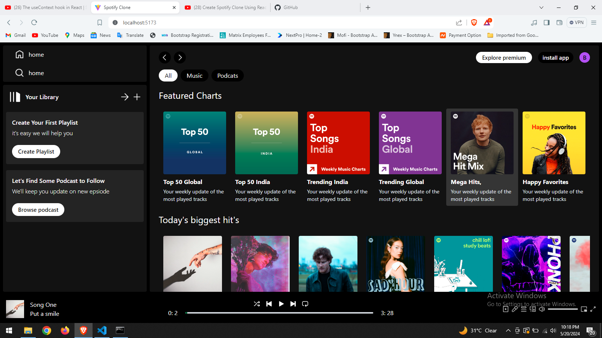

# Spotify Clone

I've developed a Spotify clone using React and Tailwind CSS. It offers essential music player functionalities like play, pause, and skip buttons, along with a seek bar. Users can easily navigate through songs, albums, and playlists, making it a seamless experience for music enthusiasts.

# Spotify clone ui image


## Technologies Used

- **React**: A JavaScript library for building user interfaces.
- **Tailwind CSS**: A utility-first CSS framework for rapid UI development.
  
## Future Work 
1. make login system
2. create dashboard add songs/ablum
3. dark/light feature
4. lazy loding feature
5. share songs feature
    
## Project Structure

### 1. Setup

First, create a new React application and install Tailwind CSS.

```bash
npm create latest@vite spotify-clone
cd spotify-clone
npm install -D tailwindcss
npx tailwindcss init
